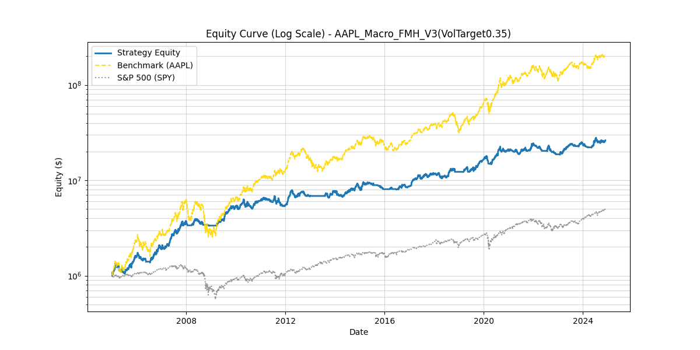

# FinancialSimulation

## Introduction

This is a backtesting program for your investing strategy.

It also supports real-time investing with low-medium frequency of operation.
In real-time case, you will receive an email to notify you to do detailed operation.

## Features

- [x] Easy to setup your own trading strategy and keep code clean.
- [x] Support yahooquery(US) and AKShare(CN). And you can add your data source with a good abstraction.
- [x] Support cost simulation including commision, tax, slippage, and dividend.
- [x] Support T+1 for CN stocks.
- [x] Support trade next day to avoid future bias.
- [x] Support plotting.
- [x] Get detailed records for trading.
- [x] Hurst exponent utility support.
- [x] A robust caching mechanism to avoid repeatedly
      downloading date from yahooquery, etc.
- [x] ......

## How to use

This python project is managed by [uv](https://docs.astral.sh/uv/).
Make sure you have installed it.

You can just clone this project into your local and run

```bash
uv run main.py
```

to run it. The `main.py` file contains a basic testing strategy.

For speedy evaluation, we implement A robust cache mechanism.
It will download data from yahooquery or similar sources into your local.
And if we have such cache, we will directly to use it.
The cache is under `./cache/`.
If it gets too big you can delete this dir to release space.

`daily_check.py` provides a simple example of how to do real-time investing.
You need to provide mailjet token to send emails.
Use the following command to run it:

```bash
uv run daily_check.py
```

Under `strategies/` there are examples about how to customize trading principles.

Congratulations! You can enjoy your trading right now!!!

## Some examples


